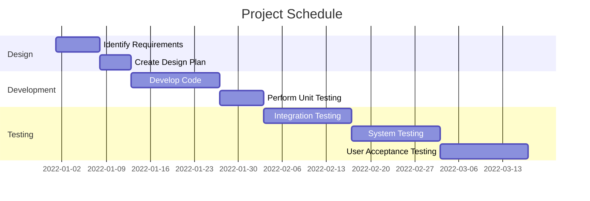

<h3 align="center">Predictive Maintenance | Status: Completed</h3>

<!-- TABLE OF CONTENTS -->

  
Table of Contents

  <ol>
    <li>
      <a href="#project-overview">Project Overview</a>
    </li>
    <li>
      <a href="#initial-mvp-breakdown">Initial MVP Breakdown</a>
    </li>
    <li>
      <a href="#business-metric/s-targetted">Business metric/s targeted</a>
    </li>
    <li>
      <a href="#stakeholders-&-ceremonies">Stakeholders & Ceremonies</a>
    </li>
    <li>
      <a href="#additional-items-for-definition-of-ready">Additional Items for Definition of Ready</a>
    </li>
    <li>
      <a href="#high-level-process-documentation">High level process documentation</a>
    </li>
    <li>
      <a href="#Project Results">Project Results</a>
    </li>
    <li>
      <a href="#Project-Schedule">Project-Schedule</a>
    </li>
  </ol>

## TL;DR:

I developed an R Shiny app that assists field engineers choose the best parts for repairs, available on their tablets during a job, to enhance customer satisfaction. The app influenced business decisions on the procurement and installation of original parts, reducing repeat appointments and boosting customer NPS.

## Project Overview:
| Work Stream | Project Title | High Level Description | Type | Indicative business value | Initial timescale | Long Term Goal | Date Raised |
| -----------: | :-----------: | :-----------: | :-----------: | :-----------: | :-----------: | :-----------: | :-----------: |
| For the Customer | Predictive Maintenance | Prevention  | Production | £200k per annum | 5 months | Assistance to field engineers replacing and ordering parts for CHB boilers| '21 |

## Initial MVP Breakdown:
- MVP 1: Produce time to failure for a sample of parts
- MVP 2: Scaling time to failure to include all parrts, including refurbished parts and association rule mining
- MVP 3: Add unusual part order detection, integrate all features (time to failure, association rules, unusual part orders) into a polished R shiny app 

## Business metric/s targetted:
|  | 🤬 Complaints | ☎️ Contact | 🚦 NPS | 📆 Reschedules | 📊 Solver/RFT/FTF | ⏳ Efficiency/FTE | 💻 OAM |
| -----------: | :-----------: | :-----------: | :-----------: | :-----------: | :-----------: | :-----------: | :-----------: |
| Increase 🔼 / 🔽 Reduction |  |  | ✔️ | ✔️ |  | ✔️ |  |

_________________________

## Stakeholders & Ceremonies

*✔️: Required, 💬: Optional Invite, ❌: Not required*

| Event | 👨‍👩‍👦 Project Team | 👨‍🏫 Project Lead | 🗝️ Product Owner | 👨‍💻 Manager | 👩‍💼 Senior Manager | 🕵️‍♀️ Subject Matter Expert (SME)|
| -----------: | :-----------: | :-----------: | :-----------: | :-----------: | :-----------: | :-----------: |
|  |  |
| **Backlog Planning & Refinement** | 💬 | ✔️ | ✔️ | 💬 | 💬 | ❌ |
| **Action (Task) Planning** | 💬 | ✔️ | ❌ | 💬 | ❌ | ❌ |
| **Stand-up** | ✔️ | ✔️ | ❌ | ✔️ | ❌ | ❌ |
| **Sprint Review** | ✔️ | ✔️ | ✔️ | ✔️ | ✔️ | ❌ |
| **Retrospective** | ✔️ | ✔️ | ❌ | 💬 | ❌ | ❌ |
| **Team Meeting** | ✔️ | ✔️ | ❌ | ✔️ | 💬 | ❌ |
| **DS Workshop** | ✔️ | ✔️ | ❌ | ✔️ | ❌ | ❌ |

_________________________

## Additional Items for Definition of Ready:
| Item | Details | Notes / Mitigation (Optional) |
| -----------: | :-----------: | :-----------: | 
| Data location/s identified | ✔️ | [comment] |
| Data location/s accessible | ✔️ | Accessible through joins on 2 databases |
| Labour resource needed (eg # Data Scientists) | 1 x Lead, 2 x Data Scientist |  [-] |
| Technical Resource needed () | R Shiny / SparklyR | [-] |
| Technical Skillset required | Association Rule Mining / Time to Failure  | [-] |
| Personal/Sensitive Data Used | ✔️ | Data obviscated and stored in locked down container  |
| Privacy Impact Assessment Required | ✔️ | PIA Ref: ****|
| Tangible output | R Shiny dashboard app available to engineers on their tablets during engineer repair visits | £200k savings per annum |

_________________________

## High level process documentation:
**Project Intent : -**  
****

- This project was born from the understanding that British Gas have experienced an increased number of repeat breakdowns and it is not clear what is causing this
- There is a need to predict when customers will have a breakdown - using a first principles approach, a breakdown takes place when a part in a boiler breaks down
- By performing time to failure on parts in a boiler, I can not only predict when a boiler will fail (% probability) but prevent it from taking place and thus prevent inbound customer contact, keep our customers happy and prevent/reduce breakdown appointment backlogs.

**Business value: -**  
****

The business was able to make better procurement decisions, negotiate with suppliers and claim back costs for parts still within warranty period. The part associations and refurbished analysis prevented customer inbound contact and repeat visits by our engineers. This creates a cycle, allowing for more engineer capacity in the field to better serve our customers.

****

## Project Results:

I developed an R Shiny app that assists field engineers in choosing the best parts for repairs, whilst at the customers property, to enhance customer satisfaction. The app presented at the highest 'Services & Logistics Management' meetings influenced business decisions on the procurement and installation of original parts, reducing repeat appointments and boosting customer NPS.

****

## Project Schedule:

The following is a Gantt chart outlining the schedule for the project:

